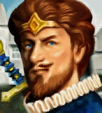

<!-- Readme generated with https://github.com/othneildrew/Best-README-Template -->
<a name="readme-top"></a>

<!-- PROJECT SHIELDS -->
<!--
*** Using markdown "reference style" links for readability.
*** Reference links are enclosed in brackets [ ] instead of parentheses ( ).
*** See the bottom of this document for the declaration of the reference variables
*** https://www.markdownguide.org/basic-syntax/#reference-style-links
-->
[![Contributors][contributors-shield]][contributors-url]
[![Forks][forks-shield]][forks-url]
[![Stargazers][stars-shield]][stars-url]
[![Issues][issues-shield]][issues-url]
[![AGPL License][license-shield]][license-url]


<!-- PROJECT LOGO -->
<br />
<div style="text-align:center;">
  <a href="https://github.com/RomainOdeval/heroes-quizz">
    
  </a>

<h3 align="center">Heroes Quizz</h3>

  <p style="text-align:center;">
    An online tool to generate and provide quizz about "Heroes of Might and Magic 3" facts (and maybe other Heroes later).
    <br />
    <a href="https://github.com/RomainOdeval/heroes-quizz"><strong>Explore the docs »</strong></a>
    <br />
    <br />
    <a href="https://github.com/RomainOdeval/heroes-quizz">View Demo</a>
    ·
    <a href="https://github.com/RomainOdeval/heroes-quizz/issues">Report Bug</a>
    ·
    <a href="https://github.com/RomainOdeval/heroes-quizz/issues">Request Feature</a>
  </p>
</div>


<!-- TABLE OF CONTENTS -->
<details>
  <summary>Table of Contents</summary>
  <ol>
    <li>
      <a href="#about-the-project">About The Project</a>
      <ul>
        <li><a href="#built-with">Built With</a></li>
      </ul>
    </li>
    <li>
      <a href="#getting-started">Getting Started</a>
      <ul>
        <li><a href="#prerequisites">Prerequisites</a></li>
        <li><a href="#installation">Installation</a></li>
      </ul>
    </li>
    <li><a href="#usage">Usage</a></li>
    <li><a href="#roadmap">Roadmap</a></li>
    <li><a href="#contributing">Contributing</a></li>
    <li><a href="#license">License</a></li>
    <li><a href="#contact">Contact</a></li>
    <li><a href="#acknowledgments">Acknowledgments</a></li>
  </ol>
</details>


<!-- ABOUT THE PROJECT -->
## About The Project

[![Product Name Screen Shot][product-screenshot]](https://example.com)

A great french streamer and HoMM3 (Heroes of Might and Magic III) player, known as [Le J](https://www.twitch.tv/le_j_heroes), loves HoMM3 facts.
[Antonin](https://github.com/AntoninTL) decided it was time to provide some fun tool to HoMM3 community and challenging them with HoMM3 quizz.
This tool was born !

How it works:
* ...
* ...
* ...

<p style="text-align:right;">(<a href="#readme-top">back to top</a>)</p>


### Built With

* [![Symfony][Symfony.com]][Symfony-url]
* [![Bootstrap][Bootstrap.com]][Bootstrap-url]

<p style="text-align:right;">(<a href="#readme-top">back to top</a>)</p>


<!-- GETTING STARTED -->
## Getting Started

This software is a classic Symfony web app. You need to have a configured web server and some prerequisites.

### Prerequisites

A few OS packages are needed to install this software.
* composer
  ```sh
  sudo apt install composer
  ```
* yarn
  ```sh
  sudo apt install yarn
  ```

### Installation

_Below is an example of how you can instruct your audience on installing and setting up your app. This template doesn't rely on any external dependencies or services._

1. Clone the repo
   ```sh
   git clone https://github.com/your_username_/Project-Name.git
   ```
   
2. Install Composer packages
   ```sh
   composer install
   ```
   
3. Install Node packages and assets
   ```sh
   yarn install
   ```

<p style="text-align:right;">(<a href="#readme-top">back to top</a>)</p>


<!-- USAGE EXAMPLES -->
## Usage

Use this space to show useful examples of how a project can be used. Additional screenshots, code examples and demos work well in this space. You may also link to more resources.

_For more examples, please refer to the [Documentation](https://example.com)_

<p style="text-align:right;">(<a href="#readme-top">back to top</a>)</p>


<!-- ROADMAP -->
## Roadmap

- [ ] Add Changelog
- [ ] Add main entities (Heroes, creatures and buildings)
- [ ] Add main quizz entities
- [ ] Add back authentication (classic Symfony authentication)
- [ ] Add front authentication (Access Token Authenticator with Twitch)
- [ ] Multi-language Support
    - [ ] English
    - [ ] French

See the [open issues](https://github.com/othneildrew/Best-README-Template/issues) for a full list of proposed features (and known issues).

<p style="text-align:right;">(<a href="#readme-top">back to top</a>)</p>


<!-- CONTRIBUTING -->
## Contributing

If you have a suggestion that would make this better, please fork the repo and create a pull request. You can also simply open an issue with the tag "enhancement".
Don't forget to give the project a star! Thanks again!

1. Fork the Project
2. Create your Feature Branch (`git checkout -b feature/AmazingFeature`)
3. Commit your Changes (`git commit -m 'Add some AmazingFeature'`)
4. Push to the Branch (`git push origin feature/AmazingFeature`)
5. Open a Pull Request

<p style="text-align:right;">(<a href="#readme-top">back to top</a>)</p>


<!-- LICENSE -->
## License

Distributed under the GNU Affero General Public (GNU AGPL) v3 License. See `LICENSE` for more information.

<p style="text-align:right;">(<a href="#readme-top">back to top</a>)</p>


<!-- CONTACT -->
## Contact

Antonin TL - [AntoninTL](https://github.com/AntoninTL)<br/>
Romain ODEVAL - [RomainOdeval](https://github.com/RomainOdeval)

Project Link: [https://github.com/RomainOdeval/heroes-quizz](https://github.com/RomainOdeval/heroes-quizz)

<p style="text-align:right;">(<a href="#readme-top">back to top</a>)</p>


<!-- ACKNOWLEDGMENTS -->
## Acknowledgments

Some external documentation quite useful to understand this project :

* [Symfony official documentation](https://symfony.com/doc/current/index.html)
* [Twitch's user access token](https://dev.twitch.tv/docs/authentication/#user-access-tokens)
* [HoMM3 community wiki](https://heroes.thelazy.net)

<p style="text-align:right;">(<a href="#readme-top">back to top</a>)</p>


<!-- MARKDOWN LINKS & IMAGES -->
<!-- https://www.markdownguide.org/basic-syntax/#reference-style-links -->
[contributors-shield]: https://img.shields.io/github/contributors/RomainOdeval/heroes-quizz.svg?style=for-the-badge
[contributors-url]: https://github.com/RomainOdeval/heroes-quizz/graphs/contributors
[forks-shield]: https://img.shields.io/github/forks/RomainOdeval/heroes-quizz.svg?style=for-the-badge
[forks-url]: https://github.com/RomainOdeval/heroes-quizz/network/members
[stars-shield]: https://img.shields.io/github/stars/RomainOdeval/heroes-quizz.svg?style=for-the-badge
[stars-url]: https://github.com/RomainOdeval/heroes-quizz/stargazers
[issues-shield]: https://img.shields.io/github/issues/RomainOdeval/heroes-quizz.svg?style=for-the-badge
[issues-url]: https://github.com/RomainOdeval/heroes-quizz/issues
[license-shield]: https://img.shields.io/github/license/RomainOdeval/heroes-quizz.svg?style=for-the-badge
[license-url]: https://github.com/RomainOdeval/heroes-quizz/LICENSE
[product-screenshot]: images/screenshot.png
[Symfony.com]: https://img.shields.io/badge/Symfony-000000?style=for-the-badge&logo=symfony&logoColor=white
[Symfony-url]: https://symfony.com
[Bootstrap.com]: https://img.shields.io/badge/Bootstrap-563D7C?style=for-the-badge&logo=bootstrap&logoColor=white
[Bootstrap-url]: https://getbootstrap.com
